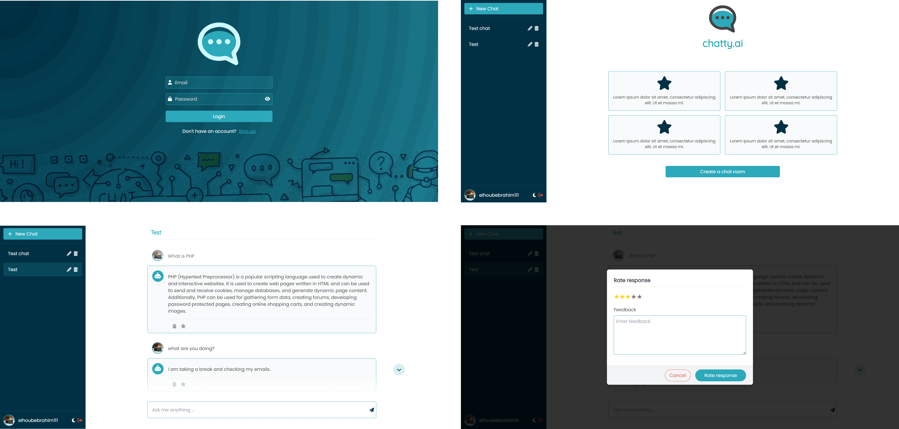
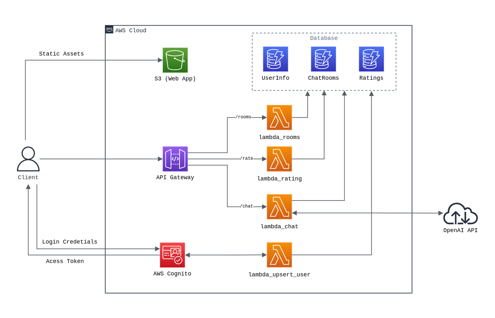

# Serverless Chatbot App

This project is a simple chatbot application created by AWS serverless architecture, React.js, and the OpenAI API. The chatbot is designed to have interactive conversations with users.




## Pre-requisites

1. AWS account & SAM CLI installed on your development environment
2. Node.js and npm installed on your development environment
3. OpenAI API key

## Architecture



In this project's architecture, Amazon Cognito is employed for user authentication, ensuring secure access for authorized users. The React.js frontend is hosted on Amazon S3.

The heart of the chatbot's functionality is formed by AWS API Gateway and Lambda functions. This serverless design allows for efficient scaling and cost-effective operation.

Additionally, DynamoDB serves as the storage solution for chat-related data, ensuring that conversations persist for reference and context.

## Getting Started

To get started, clone this repository to your local machine using the following command:

```bash
git clone https://github.com/ElhoubeBrahim/serverless-chatbot.git
```

### Backend

Inside the `server` folder, create an `env.json` file. This file will hold your OpenAI API key and the name of the chatrooms table in DynamoDB. Ensure that your `env.json` has the following structure:

```json
{
	"Parameters": {
		"OPENAI_API_KEY": "openai_api_key",
		"CHAT_ROOMS_TABLE": "chatbot-chat-rooms"
	}
}
```

In the `server` folder, you can run the `./scripts/deploy.py` script to deploy the backend services. Alternatively, you can use the following command:

```bash
sam deploy --parameter-overrides $(cat env.json)
```

Once the deployment is successful, you can view the services in the AWS Console.

### Frontend

In the `client` folder, install the necessary dependencies with:

```bash
npm install
```

Inside the `src/secure` folder, create two files: `api.tsx` and `aws.tsx`. Populate them with the code from the `api.example.tsx` and `aws.example.tsx` files, respectively. Don't forget to replace the API URL with the one generated in the previous step.

You can find the API URL and User Pools IDs in the AWS Console, specifically in the API Gateway and Cognito services.

To run the application, execute the following command:

```bash
npm run dev
```

## Resources

- https://docs.aws.amazon.com/serverless-application-model/latest/developerguide/what-is-sam.html
- https://aws.amazon.com/blogs/compute/a-simpler-deployment-experience-with-aws-sam-cli/
- https://docs.amplify.aws/lib/auth/getting-started/q/platform/js/
- https://platform.openai.com/docs/api-reference/introduction
